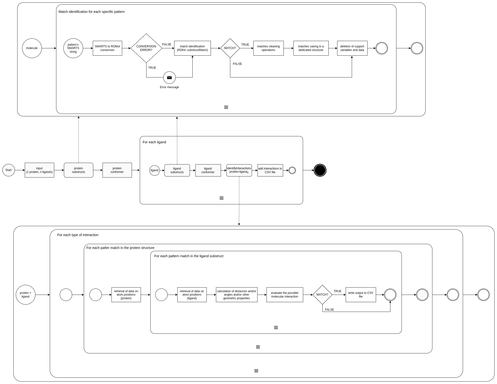

# Analysis and Implementation of Methods for Identifying Target Sites within Proteins to Support Drug Discovery


A CUDA-accelerated C++/RDKit tool that detects protein-ligand interactions from PDB/MOL2 inputs and exports structured CSV outputs, with profiling and reproducibility utilities.

## Key Features / Highlights

The project is a command line tool for protein-ligand interaction analysis. Given a protein in PDB format and one or more ligands in MOL2 format, it parses the molecules, uses RDKit to detect atom and ring level features via SMARTS patterns, for each interaction type forms the cartesian product of features found in the protein and in the ligands and applies geometric checks (distances, angles, planarity) to keep only physically plausible contacts. The implementation provides a solid CPU baseline and where the workload justifies it, CUDA acceleration of the most compute intensive kernels. You run it through a minimal CLI instruction and it emits a structured CSV. For reproducible performance evaluation, the repository includes Bash and Python utilities to compare CPU and GPU runs over test samples. Code documentation can be generated with the provided Doxygen configuration, yielding a navigable view of the project’s main components.

## How It Works (High-level)

- Parse one protein (PDB) and N ligands (MOL2) while retaining hydrogens.
- Use SMARTS patterns to detect feature instances independently in protein and ligand.
- For each interaction type, compute the cartesian product of protein/ligand features.
- Apply distance/angle/planarity constraints to confirm valid interactions.
- Emit one CSV row per confirmed interaction.



## GPU Acceleration (Overview)

The GPU backend accelerates the hot spot where the program evaluates the Cartesian products of protein/ligand feature pairs for each interaction type (hydrophobic, hydrogen bond, halogen bond, ionic, π-stacking, metal coordination). RDKit supplies the detected features; ring centroids and normals are precomputed on the CPU. On the device, a 2D grid of threads tiles the A×B pair space and applies early distance cutoffs and cosine-based angle windows to avoid unnecessary `sqrt`/`acos`. Data movement is minimized by keeping ligand-side arrays resident on the GPU and streaming protein chunks from pinned host memory; optional multiple streams overlap transfers and kernel execution. Kernels write distances for valid pairs and sentinel values otherwise; the host then scans results and emits CSV rows. In practice, offload the complex, geometry-heavy checks to the GPU and keep simple distance-only interactions on the CPU when input sizes are small.

## Intermolecular Interactions

| Type               | Constraint (summary)                                                                                                                                                  |
|--------------------|-----------------------------------------------------------------------------------------------------------------------------------------------------------------------|
| Hydrophobic        | Atom-atom distance ≤ 4.5 Å.                                                                                                                                           |
| Hydrogen bond      | Donor-acceptor distance ≤ 3.5 Å; D-H…A angle 130-180°.                                                                                                                |
| Halogen bond       | Donor-acceptor distance ≤ 3.5 Å; Donor-X…Acceptor angle 130-180°; X-Acceptor-Any angle 80-140°.                                                                      |
| Ionic              | Cation-anion distance ≤ 4.5 Å; or cation-ring centroid distance ≤ 4.5 Å and normal-vector angle 0-30°.                                                                |
| π-Stacking         | **Sandwich:** centroid distance ≤ 5.5 Å; plane angle 0-30°; normal-centroid 0-33°. **T-shape:** centroid ≤ 6.5 Å; plane angle 50-90°; normal-centroid 0-30°; projection inside ring. |
| Metal coordination | Metal-chelated distance ≤ 2.8 Å.                                                                                                                                      |

## Requirements

- **GCC** — C++ compiler. ([Download GCC](https://gcc.gnu.org/))
- **CUDA Toolkit / NVCC** — for GPU builds. ([CUDA downloads](https://developer.nvidia.com/cuda-downloads))
- **RDKit** — cheminformatics toolkit (keep hydrogens when loading PDB/MOL2). ([RDKit Installation Guide](https://www.rdkit.org/docs/Install.html))
- **CMake** — build system generator. ([Download CMake](https://cmake.org/download/))

## Build

```bash
mkdir build
cmake -S . -B build
cmake --build build
```

## Run

```bash
./build/interaction protein.pdb ligand1.mol2 ligand2.mol2 ...
```
Inputs: 
- first argument is the protein in **PDB** format;
- subsequent arguments are one or more ligands in **MOL2** format.

## Output

The tool writes a CSV where each row is a confirmed interaction with identifiers, roles, 3D coordinates, interaction type, and distance (Å).

**Example (subset, three rows):**

| Ligand            | Protein atom ID | Protein pattern   | Prot X  | Prot Y  | Prot Z  | Ligand atom ID | Ligand pattern     | Lig X   | Lig Y     | Lig Z    | Interaction type | Distance (Å) |
|-------------------|------------------|-------------------|--------:|--------:|--------:|----------------|--------------------|--------:|----------:|---------:|------------------|-------------:|
| `./1a07_ligand`   | B.TYR205.CG      | Hydrophobic       | 42.292  | -2.907  | 44.092  | 55(C)          | Hydrophobic        | 44.13   | -6.969    | 43.991   | Hydrophobic      | 4.45963      |
| `./1a07_ligand`   | B.ARG158.2HH1    | Hydrogen donor    | 46.248  | -6.788  | 36.183  | 37(O)          | Hydrogen acceptor  | 44.733  | -7.088    | 37.682   | Hydrogen Bond    | 2.94185      |
| `./1a07_ligand`   | B.ARG158.NH2     | Cation            | 43.962  | -6.230  | 35.465  | 45(C)          | `Aromatic_ring`    | 40.3165 | -6.38583  | 37.1967  | Ionic            | 4.03889      |

## Performance & GPU Trade-offs

GPU acceleration pays off only when there’s enough parallel work to amortize fixed costs such as kernel-launch latency and host-device transfers; for small pockets or ligands, these overheads can dominate. Simple interaction evaluations that are essentially single distance checks (hydrophobic, ionic, metal) rarely utilize the GPU effectively and may run faster on the CPU. By contrast, more complex interactions that involve multiple angles, planarity tests or composite geometric constraints (hydrogen bonds, π-stacking, halogen bonds) scale better on the GPU, with clearer gains as system size grows. In practice, a hybrid strategy is most effective: offload only the heavy kernels to the GPU while keeping lightweight, distance-only checks on the CPU to minimize overhead.


## Reproducing Benchmarks / Profiling

```bash
# CPU vs GPU testing on N samples in testing_samples/
./support/testing_profile_CPU.sh N
./support/testing_profile_GPU.sh N
```
- Each run writes per-pair CSVs with timings and identified interactions.

```bash
# Generate per-sample comparisons and aggregate analysis
python3 support/performance/generate_comparisons.py
python3 support/performance/analyze_comparison.py
```
- `generate_comparisons.py` creates side-by-side CPU/GPU CSVs for each sample.  
- `analyze_comparison.py` summarizes differences and saves a PNG bar chart of speedups/slowdowns.

## Documentation

Generate API docs with Doxygen (config provided as `Doxygen.txt`):

```bash
doxygen Doxygen.txt
```
Open `doxygen_docs/html/index.html` in your browser.

For a broader, non-API overview of the project consult the LaTeX authored project report included in the repository as a PDF (`project-report.pdf`). This document describes the thinking behind the work rather than the source code itself.

## Acknowledgments

Project by **Niccolò Benetti** and **Lorenzo Trombini**.  
Supervision and support: **Gianluca Palermo**, **Davide Gadioli**, **Gianmarco Accordi**.